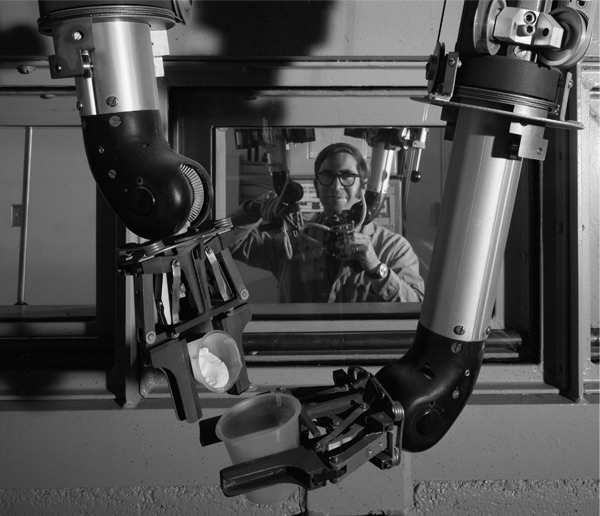

```{r setup, include=FALSE}
library(tint)
knitr::opts_chunk$set(tidy = FALSE)
options(htmltools.dir.version = FALSE)

library("seplyr")
sc <- sparklyr::spark_connect(version='2.2.0', 
   master = "local")
d <- dplyr::starwars %.>%
  select_se(., c("name", "height", "mass")) %.>%
  dplyr::copy_to(sc, ., "starwars")
```

> "[`R`](https://www.r-project.org) is its packages."

One great example of this is: the [`sparklyr` package](https://CRAN.R-project.org/package=sparklyr), which allows
`R` to work with big data.  In this note we we will use the `sparklyr` package, but concentrate on another important package called [`cdata`](https://winvector.github.io/cdata/).

In the following example the table we are working with
is remote. For all we know it could be distributed on a large remote data center.^[Working with remote data tools can be like working with a [Waldo system](https://en.wikipedia.org/wiki/Remote_manipulator): powerful, but a touch awkward. ]

```{r data}
library("seplyr")

d <- dplyr::tbl(sc, "starwars") %.>%
  arrange_se(., "name")
print(d)
```

Suppose we needed to un-pivot this data into a row oriented representation.
Often big data transform steps can achieve a much higher degree of parallelization
with "tall data"^[many rows, fewer columns].  With the [`cdata` package](https://winvector.github.io/cdata/) this
transform is easy and performant, as we show below.

```{r unpivot}
library("cdata")

cT <- buildUnPivotControlTable(
  nameForNewKeyColumn = "measurement",
  nameForNewValueColumn = "value",
  columnsToTakeFrom = c('height', 'mass') )
dTName <- moveValuesToRowsN(
  "starwars", 
  controlTable = cT, 
  my_db = sc, 
  columnsToCopy = "name")

str(dTName)

qlook(sc, dTName)
```

`cdata` can work fluidly with [`dplyr`](https://CRAN.R-project.org/package=dplyr).^[However, `cdata` does not require `dplyr`.]

```{r p1}
dT <- dplyr::tbl(sc, dTName)

dT %.>%
  arrange_se(., c("name", "measurement")) %.>%
  head(., n = 12) %.>%
  knitr::kable(.)
```

`cdata` is itself is based on `SQL` aggregations,
using the [`DBI` package](https://CRAN.R-project.org/package=DBI).^[This is why "BB8"'s `NA`
(likely represented on the remote system as a `NULL`) gets changed to a `NaN`.]

The important thing is: the data stays remote^[`class(dT)`: `r class(dT)`], all operations are performed
on the remote big data system, possibly in parallel.^[Note: the [`tidyr` package](https://CRAN.R-project.org/package=tidyr) does not currently (`r packageVersion("tidyr")`) work with remote data: `tidyr::gather(d, key=measurement, value=value, mass, height)` `r tryCatch(tidyr::gather(d, key=measurement, value=value, mass, height), error=function(e) {as.character(e)})`.]

The `cdata` arguments are deliberately verbose.  This is because at some point you
may have to read your own code, and it is best to be reminded about the role of each
function argument at that time.

Notice `cdata` takes *names* of tables as arguments and also returns *names*
of tables (not values or `dplyr::tbl()` handles).  This is why we show the explicit
use of `dplyr::tbl()` to produce remote data handles in this example.^[Basing storage on names
instead of handles means: for production code you need tools to help manage table 
lifetime. `cdata::makeTempNameGenerator()` is supplied for that purpose.  As
in-memory data doesn't have representation names in the same sense remote data does,
`cdata` supplies in-memory value to value functions: `moveValuesToRowsD()`, `buildPivotControlTableD()`,
and `moveValuesToColumnsD()`.]

The reverse operation (often called pivoting) is also easy (and in
fact shares the same control structures).

```{r pivot}
dL <- moveValuesToColumnsN(
  dTName,
  keyColumns = "name",
  controlTable = cT,
  my_db = sc ) %.>%
  dplyr::tbl(sc, .)

dL %.>%
  arrange_se(., "name") %.>%
  head(., n = 6) %.>%
  knitr::kable(.)
```


More^[The source code that produced this article can be [downloaded from here](http://winvector.github.io/FluidData/DataWranglingAtScale.Rmd).] on these sort of transforms can be found in the following notes:

 * [Theory of coordinatized data](http://winvector.github.io/FluidData/RowsAndColumns.html)
 * [Fluid data transforms](http://winvector.github.io/FluidData/FluidData.html)

 


