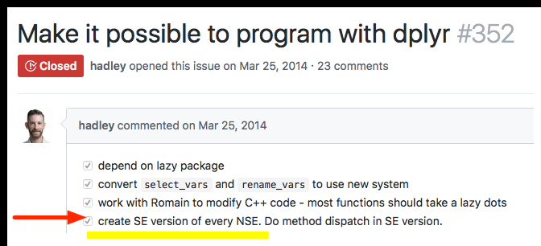

# Introduction

[`seplyr`](https://winvector.github.io/seplyr/) is an [`R`](https://www.r-project.org) package 
that supplies improved standard evaluation interfaces for many common data wrangling tasks.

The core of `seplyr` is a 
re-skinning of [`dplyr`](https://CRAN.R-project.org/package=dplyr)'s 
to `seplyr` conventions (similar to how [`stringr`](https://CRAN.R-project.org/package=stringr) 
re-skins the implementing package [`stringi`](https://CRAN.R-project.org/package=stringi)).

# Standard Evaluation and Non-Standard Evaluation

"Standard evaluation" is the name we are using for the value oriented calling convention found in many programming languages.  The idea is: functions are only allowed to look at the values of their arguments and not how those values arise (i.e., they can not look at source code or variable names). This evaluation principle allows one to transform, optimize, and reason about code. 

It is what let's us say the following two snippets of code are equivalent.

  * `x <- 4; sqrt(x)`
  * `x <- 4; sqrt(4)`
  
The mantra is: 

> "variables can be replaced with their values."

Which is called [referential transparency](https://en.wikipedia.org/wiki/Referential_transparency).

["Non-standard evaluation"](http://adv-r.had.co.nz/Computing-on-the-language.html) is the name used for code that more aggressively inspects its environment. It is often used for harmless tasks such as conveniently setting axis labels on plots.  For example, notice the following two plots have different y-axis labels (despite plotting identical values).

```{r plot1, out.width='50%'}
plot(x = 1:3)

plot(x = c(1,2,3))
```

# `dplyr` and `seplyr`

The `dplyr` authors appear to *strongly* prefer a non-standard evaluation interface.  Many in the `dplyr` community have come to *think* a package such as `dplyr` requires a non-standard interface. `seplyr` started as an experiment to show this is not actually the case.

Syntactically the packages are deliberately similar.

We can take a `dplyr` pipeline:

```{r dpipe1}
suppressPackageStartupMessages(library("dplyr"))

starwars %>%
  select(name, height, mass) %>%
  arrange(desc(height)) %>%
  head()
```

And re-write it in `seplyr` notation:

```{r sepipe1}
library("seplyr")

starwars %.>%
  select_se(., c("name", "height", "mass")) %.>%
  arrange_se(., "desc(height)") %.>%
  head(.)
```

For the common `dplyr`-verbs (excluding `mutate()`, which we will discuss next) all the non-standard evaluation is saving us is a few quote marks and array designations (and we have [ways of getting rid of the need for quote marks](https://winvector.github.io/wrapr/reference/qc.html)).  In exchange for this small benefit the [non-standard evaluation is needlessly hard to program over](http://www.win-vector.com/blog/2017/06/non-standard-evaluation-and-function-composition-in-r/). For instance in the `seplyr` pipeline it is easy to accept the list of columns from an outside source as a simple array of names.

Until you introduce a substitution system such as [`rlang`](https://CRAN.R-project.org/package=rlang) or [`wrapr::let()`](https://winvector.github.io/wrapr/articles/let.html) (which [we recommend over `rlang`](http://www.win-vector.com/blog/2017/11/let-xx-in-r/) and [publicly pre-dates the public release of `rlang`](http://www.win-vector.com/blog/2017/08/lets-have-some-sympathy-for-the-part-time-r-user/)) you have some difficulty writing re-usable programs that use the `dplyr` verbs over "to be specified later" column names.

We are presumably not the only ones who considered this a limitation:

[](https://github.com/tidyverse/dplyr/issues/352)

`seplyr` is an attempt to make programming a primary concern by 
making the value-oriented (standard) interfaces the primary interfaces.

# `mutate()`

The earlier "standard evaluation costs just a few quotes" becomes a bit strained when we talk about the `dplyr::mutate()` operator.  It doesn't seem worth the effort unless you get something more in return.  In `seplyr` `0.5.0` we introduced "the something more": planning over and optimizing `dplyr::mutate()` sequences.

A `seplyr` mutate looks like the following:

```{r mutatese1}
starwars %.>%
  select_se(., c("name", "height", "mass")) %.>%
  mutate_se(., c(
    "height" := "height + 1",
    "mass" := "mass + 1",
    "height" := "height + 2",
    "mass" := "mass + 2",
    "height" := "height + 3",
    "mass" := "mass + 3"
  )) %.>%
  arrange_se(., "name") %.>%
  head(.)
```

`seplyr::mutate_se()` always uses "`:=`" to denote assignment (`dplyr::mutate()` prefers "`=`" for assignment, except in cases where "`:=`" is required).

The advantage is: once we are go to the trouble to capture the mutate expressions we can treat them *as data* and apply procedures to *them*.  For example we can re-group and optimize the mutate assignments.

```{r mutateopt1}
plan <- partition_mutate_se(
  c("name" := "tolower(name)",
    "height" := "height + 0.5",
    "height" := "floor(height)",
    "mass" := "mass + 0.5",
    "mass" := "floor(mass)"))
print(plan)
```

Notice `seplyr::partition_mutate_se()` re-ordered and re-grouped the assignments so that:

 * In each group each value used is independent of values produced in other assignments.
 * All dependencies between assignments are respected by the group order.

The "safe block" assignments can then be used in a pipeline:


```{r mutateoptuse}
starwars %.>%
  select_se(., c("name", "height", "mass")) %.>%
  mutate_seb(., plan) %.>%
  arrange_se(., "name") %.>%
  head(.)
```

This may not seem like much.  However, when using `dplyr` with a `SQL` database (such as `PostgreSQL` or even `Sparklyr`) keeping the number of dependencies in a block low is [critical for correct calculation](https://github.com/WinVector/Examples/blob/master/dplyr/Dependencies.md) (which is why I [recommend keeping dependencies low](http://www.win-vector.com/blog/2017/09/my-advice-on-dplyrmutate/)). Furthermore, on `Sparklyr` sequences of `mutate`s are simulated by nesting of `SQL` statements, so you must also keep the number of `mutate`s at a moderate level (i.e., you want a minimal number of blocks or groups).

# Machine Generated Code

Because we are representing `mutate` assignments as user manipulable data we can also enjoy the benefit of machine generated code.  `seplyr` `0.5.*` uses this opportunity to introduce a simple function named `if_else_device()`.   This device uses `R`'s `ifelse()` statement (which conditionally chooses values in a vectorized form) to implement a more powerful [block-if/else statement](http://www.win-vector.com/blog/2017/11/vectorized-block-ifelse-in-r/) (which conditionally simultaneously controls blocks of values and assignments; [`SAS` has such a feature](http://support.sas.com/documentation/cdl/en/lrdict/64316/HTML/default/viewer.htm#a000201978.htm)).

For example: suppose we want to `NA`-out one of `height` or `mass` for each row of the `starwars` data.  This can be written naturally using the `if_else_device`.

```{r ifelsedevice}
if_else_device(
  testexpr = "runif(n())>=0.5",
  thenexprs = "height" := "NA",
  elseexprs = "mass" := "NA")
```

Notice the `if_else_device` translates the user code into a sequence of `dplyr::mutate()`  expressions (using only the weaker operator `ifelse()`).  Obviously the user could perform this translation, but `if_else_device` automates the record keeping and [can even be nested](https://winvector.github.io/seplyr/reference/if_else_device.html). Also many such steps can be chained together and broken into a minimal sequence of blocks by `partition_mutate_se()` (not forcing a new `dplyr::mutate()` step for each if-block encountered).

When we combine the device with the partitioned we get performant database-safe code where the number of blocks is only the level of variable dependence (and not the possibly much larger number of initial value uses that a straightforward non-reordering split would give; note: `seplyr::mutate_se() 0.5.1` and later incorporate the `partition_mutate_se()` in `mutate_se()`).

```{r ifelsedev2}
starwars %.>%
  select_se(., c("name", "height", "mass")) %.>%
  mutate_se(., if_else_device(
    testexpr = "runif(n())>=0.5",
    thenexprs = "height" := "NA",
    elseexprs = "mass" := "NA")) %.>%
  arrange_se(., "name") %.>%
  head(.)
```

# Conclusion

The value oriented notation is a bit clunkier, but this is offset by it's greater
flexibility in terms of composition and working parametrically.

Our group has been using `seplyr::if_else_device()` and `seplyr::partition_mutate_se()` to greatly simplify porting powerful `SAS` procedures to `R`/`Sparklyr`/`Apache Spark` clusters.

This is new code, but we are striving to supply sufficient initial [documentation and examples](http://www.win-vector.com/blog/2017/11/win-vector-llc-announces-new-big-data-in-r-tools/).


