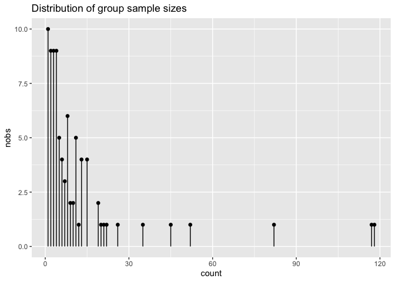
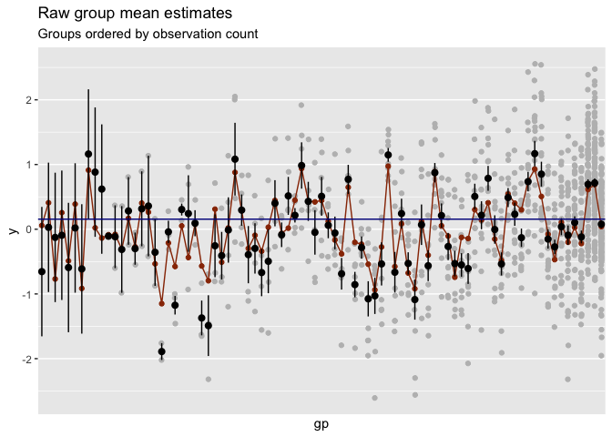
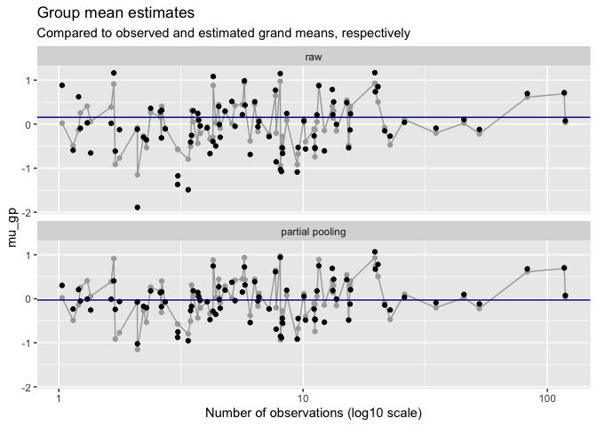
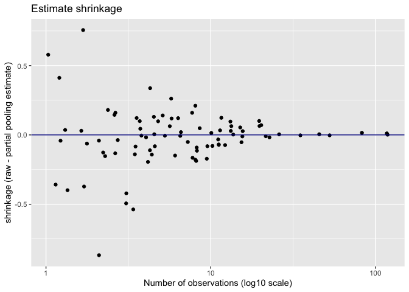
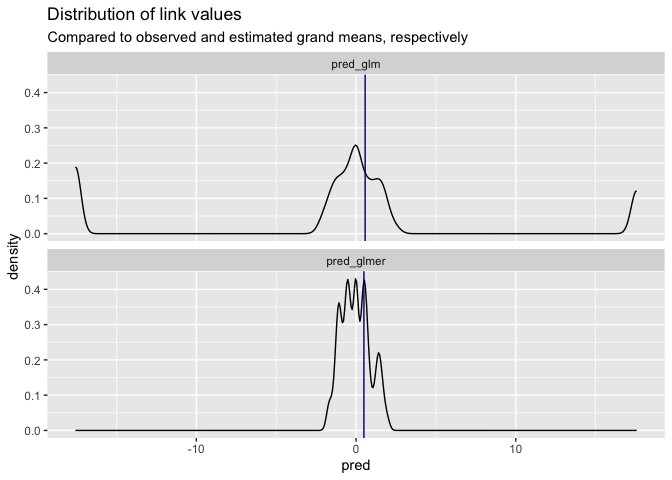
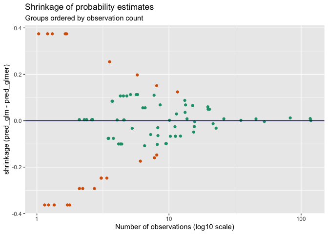

<figure align="center">

<figcaption> <small>
Banaue rice terraces. Photo: <a href="https://www.flickr.com/photos/london/319347366">Jon Rawlinson</a>
</small></figcaption>
</figure>
<br><br>


In a previous article, we showed the use of partial pooling, or hierarchical/multilevel models, for level coding high-cardinality categorical variables in [`vtreat`](https://winvector.github.io/vtreat/). In this article, we will discuss a little more about the how and why of partial pooling in [`R`](https://www.r-project.org).

We will use the `lme4` package to fit the hierarchical models. The acronym "lme" stands for "linear mixed-effects" models: models that combine so-called "fixed effects" and "random effects" in a single (generalized) linear model. The `lme4` documentation uses the random/fixed effects terminology, but we are going to follow Gelman and Hill, and avoid the use of the terms "fixed" and "random" effects.

> The varying coefficients [corresponding to the levels of a categorical variable] in a multilevel model are sometimes called *random effects*, a term that refers to the randomness in the probability model for the group-level coefficients....

> The term *fixed effects* is used in contrast to random effects -- but not in a consistent way! ... Because of the conflicting definitions and advice, we will avoid the terms "fixed" and "random" entirely, and focus on the description of the model itself...

-- Gelman and Hill 2007, Chapter 11.4

We will also restrict ourselves to the case that `vtreat` considers: partially pooled estimates of conditional group expectations, with no other predictors considered.

## The Data

Let's assume that the data is generated from a mixture of $M$ populations; each population is normally distributed with (unknown) means $\mu_{gp}$, all with the same (unknown) standard deviation $\sigma_w$:

$$
y_{gp} = N(\mu_{gp}, {\sigma_{w}}^2)
$$

The population means themselves are normally distributed, with unknown mean $\mu_0$ and unknown standard deviation $\sigma_b$:

$$
\mu_{gp} = N(\mu_0, {\sigma_{b}}^2)
$$

(The subscripts *w* and *b* stand for "within-group" and "between-group" standard deviations, respectively.)


We can generate a synthetic data set according to these assumptions, with distributions similar to the distributions observed in the radon data set that we used in our earlier post: 85 groups, sampled unevenly. We'll use $\mu_0 = 0, \sigma_w = 0.7, \sigma_b = 0.5$. Here, we take a peek at our data, `df`.


``` r
head(df)
```

```
##     gp          y
## 1 gp75  1.1622536
## 2 gp26 -1.0026492
## 3 gp26 -0.4317629
## 4 gp43  0.3547021
## 5 gp19 -0.5028478
## 6 gp41  0.1239806
```

<!-- -->

As the graph shows, some groups were heavily sampled, but most groups have only a handful of samples in the data set. Since this is synthetic data, we know the true population means (shown in red in the graph below), and we can compare them to the observed means $\bar{y}_i$ of each group $i$ (shown in black, with standard errors. The gray points are the actual observations). We've sorted the groups by the number of observations.

<!-- -->

For groups with many observations, the observed group mean is near the true mean. For groups with few observations, the estimates are uncertain, and the observed group mean can be far from the true population mean.

Can we get better estimates of the conditional mean for groups with only a few observations?

## Partial Pooling

If the data is generated by the process described above, and if we knew $\sigma_w$ and $\sigma_b$, then a good estimate $\hat{y}_i$ for the mean of group $i$ is the weighted average of the grand mean over all the data, $\bar{y}$, and the observed mean of all the observations in group $i$, $\bar{y}_i$.

$$
\large
\hat{y_i} \approx \frac{\frac{n_i} {\sigma_w^2} \cdot \bar{y}_i  + \frac{1}{\sigma_b^2} \cdot \bar{y}}
 {\frac{n_i} {\sigma_w^2} + \frac{1}{\sigma_b^2}}
$$


where $n_i$ is the number of observations for group $i$. In other words, for groups where you have a lot of observations, use an estimate close to the observed group mean. For groups where you have only a few observations, fall back to an estimate close to the grand mean.

Gelman and Hill call the grand mean the *complete-pooling* estimate, because the data from all the groups is pooled to create the estimate \hat{y_i} (which is the same for all $i$). The "raw" observed means are the *no-pooling* estimate, because no pooling occurs; only observations from group $i$ contribute to $\hat{y_i}$. The weighted sum of the complete-pooling and the no-pooling estimate is hence the *partial-pooling* estimate.

Of course, in practice we don't know $\sigma_w$ and $\sigma_b$. The `lmer` function essentially solves for the restricted maximum likelihood (REML) estimates of the appropriate parameters in order to estimate $\hat{y_i}$. You can express multilevel models in `lme4` using the notation `| gp` in formulas to designate that `gp` is the grouping variable that you want conditional estimates for. The model that we are interested in is the simplest: outcome as a function of the grouping variable, with no other predictors.


``` r
poolmod = lmer(y ~ (1 | gp), data=df)
```

See section 2.2 of [this `lmer` vignette](https://cran.r-project.org/web/packages/lme4/vignettes/lmer.pdf) for more discussion on writing formulas for models with additional predictors. Printing `poolmod` displays the REML estimates of the grand mean (The intercept), $\sigma_b$ (the standard deviation of $gp$) and $\sigma_w$ (the residual).


``` r
poolmod
```

```
## Linear mixed model fit by REML ['lmerMod']
## Formula: y ~ (1 | gp)
##    Data: df
## REML criterion at convergence: 2282.939
## Random effects:
##  Groups   Name        Std.Dev.
##  gp       (Intercept) 0.5348  
##  Residual             0.7063  
## Number of obs: 1002, groups:  gp, 85
## Fixed Effects:
## (Intercept)  
##    -0.02761
```

To pull these values out explicitly:

``` r
# the estimated grand mean 
(grandmean_est= fixef(poolmod))
```

```
## (Intercept) 
## -0.02760728
```

``` r
# get the estimated between-group standard deviation
(sigma_b = as.data.frame(VarCorr(poolmod)) %>% 
  filter(grp=="gp") %>% 
  pull(sdcor))
```

```
## [1] 0.5348401
```

``` r
# get the estimated within-group standard deviation
(sigma_w = as.data.frame(VarCorr(poolmod)) %>% 
  filter(grp=="Residual") %>% 
  pull(sdcor))
```

```
## [1] 0.7063342
```

`predict(poolmod)` will return the partial pooling estimates of the group means. Below, we compare the partial pooling estimates to the raw group mean expectations. The gray lines represent the true group means, the dark blue horizontal line is the observed grand mean, and the black dots are the estimates. We have again sorted the groups by number of observations, and laid them out (with a slight jitter) on a log10 scale.

<!-- -->

For groups with only a few observations, the partial pooling "shrinks" the estimates towards the grand mean[^1], which often results in a better estimate of the true conditional population means. We can see the relationship between shrinkage (the raw estimate minus the partial pooling estimate) and the groups, ordered by sample size.

<!-- -->

For this data set, the partial pooling estimates are on average closer to the true means than the raw estimates; we can see this by comparing the root mean squared errors of the two estimates.


<table class="table" style="width: auto !important; margin-left: auto; margin-right: auto;">
 <thead>
  <tr>
   <th style="text-align:left;"> estimate_type </th>
   <th style="text-align:right;"> rmse </th>
  </tr>
 </thead>
<tbody>
  <tr>
   <td style="text-align:left;"> raw </td>
   <td style="text-align:right;"> 0.3261321 </td>
  </tr>
  <tr>
   <td style="text-align:left;"> partial pooling </td>
   <td style="text-align:right;"> 0.2484646 </td>
  </tr>
</tbody>
</table>

[^1]: To be precise, partial pooling shrinks estimates toward the *estimated* grand mean -0.0276, not to the *observed* grand mean 0.155. 


### The Discrete Case

For discrete (binary) outcomes or classification, use the function `glmer()` to fit multilevel logistic regression models. Suppose we want to predict $\mbox{P}(y > 0 \,|\, gp)$, the conditional probability that the outcome $y$ is positive, as a function of $gp$.


``` r
df$ispos = df$y > 0

# fit a logistic regression model
mod_glm = glm(ispos ~ gp, data=df, family=binomial)
```

Again, the conditional probability estimates will be highly uncertain for groups with only a few observations. We can fit a multilevel model with `glmer` and compare the distributions of the resulting predictions in link space.


``` r
mod_glmer = glmer(ispos ~ (1|gp), data=df, family=binomial)
```

<!-- -->

Note that the distribution of predictions for the standard logistic regression model is trimodal, and that for some groups, the logistic regression model predicts probabilities very close to 0 or to 1. In most cases, these predictions will correspond to groups with few observations, and are unlikely to be good estimates of the true conditional probability. The partial pooling model avoids making *unjustified* predictions near 0 or 1, instead “shrinking” the estimates to the estimated global probability that $y > 0$, which in this case is about 0.49. 

We can see how the number of observations corresponds to the shrinkage (the difference between the logistic regression and the partial pooling estimates) in the graph below (this time in probability space). Points in orange correspond to groups where the logistic regression estimated probabilities of 0 or 1 (the two outer lobes of the response distribution). Multimodal densities are often symptoms of model flaws such as omitted variables or un-modeled mixtures, so it is exciting to see the partially pooled estimator avoid the "wings" seen in the simpler logistic regression estimator.

<!-- -->


## Partial Pooling Degrades Gracefully

When there is enough data for each population to get a good estimate of the population means -- for example, when the distribution of groups is fairly uniform, or at least not too skewed -- the partial pooling estimates will converge to the the raw (no-pooling) estimates. When the variation between population means is very low, the partial pooling estimates will converge to the complete pooling estimate (the grand mean).

When there are only a few levels (Gelman and Hill suggest less than about five), there will generally not be enough information to make a good estimate of $\sigma_b$, so the partial pooled estimates likely won't be much better than the raw estimates.

So partial pooling will be of the most potential value when the number of groups is large, and there are many rare levels. With respect to `vtreat`, this is exactly the situation when level coding is most useful! 

Multilevel modeling assumes the data was generated from the mixture process above: each population is normally distributed, with the same standard deviation, and the population means are also normally distributed. Obviously, this may not be the case, but as Gelman and Hill argue, the additional inductive bias can be useful for those populations where you have little information.

Thanks to [Geoffrey Simmons](https://www.linkedin.com/in/geoffrey-simmons-bb675242/), Principal Data Scientist at Echo Global Logistics, for suggesting partial pooling based level coding for `vtreat`, introducing us to the references, and reviewing our articles.

## References

Gelman, Andrew and Jennifer Hill. *Data Analysis Using Regression and Multilevel/Hierarchical Models*. Cambridge University Press, 2007.
